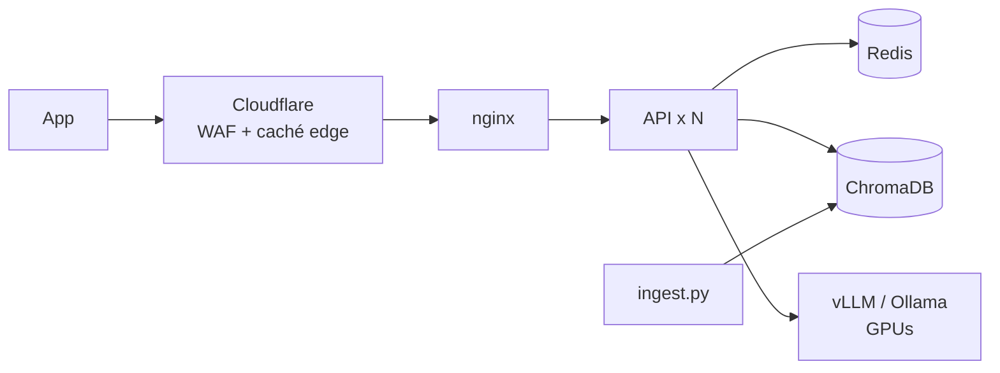

# mi-argentina-ia

> Prueba de concepto independiente. No es un servicio oficial de Mi Argentina ni está vinculado al
> Estado nacional. La información de las preguntas frecuentes sale de argentina.gob.ar.

Asistente para responder consultas sobre trámites y servicios de Mi Argentina con modelos que corren
en servidores propios, sin depender de APIs externas. Responde solo con lo que dicen las preguntas
frecuentes oficiales (RAG) y está armado para bancar picos grandes de tráfico usando caché en varios
niveles, réplicas y control de carga sobre las GPUs.

Stack: FastAPI + Gunicorn, LangChain, Ollama o vLLM (Llama 3.1 8B), embeddings bge-m3, ChromaDB,
Redis, nginx y un Worker de Cloudflare para la caché en el edge. Todo levanta con Docker Compose.

## Contenido

1. [Cómo responde una consulta](#cómo-responde-una-consulta)
2. [Estructura](#estructura)
3. [Instalación](#instalación)
4. [API](#api)
5. [Seguridad](#seguridad)
6. [Escalar a 1 millón de usuarios](#escalar-a-1-millón-de-usuarios)
7. [Configuración](#configuración)
8. [Tests](#tests)
9. [Problemas comunes](#problemas-comunes)
10. [Pendientes](#pendientes)

## Cómo responde una consulta

La idea es cortar lo antes posible: la GPU solo trabaja si ninguna capa anterior pudo responder.

1. Rate limit por cliente (Redis, compartido entre réplicas).
2. Limpieza de la pregunta y control de largo (caracteres y tokens).
3. Detección de intentos de prompt injection. Si hay uno, se responde el mensaje de rechazo sin llamar al modelo.
4. Enmascarado de datos personales (DNI, CUIL, mail, teléfono, tarjeta) antes de seguir.
5. Caché exacta en Redis sobre la pregunta normalizada (sin tildes, mayúsculas, signos ni saludos).
6. Embedding de la pregunta y caché semántica (misma intención con otras palabras).
7. Búsqueda en las FAQ. Si nada supera el umbral de relevancia, la pregunta está fuera de tema y se rechaza sin llamar al modelo.
8. Single-flight: si muchas personas preguntan lo mismo al mismo tiempo, se genera una sola respuesta.
9. Generación con el system prompt y límite de concurrencia hacia el modelo (si está saturado, 503 con `Retry-After`).
10. Control de la salida (fuga del prompt, enlaces no oficiales, HTML) y guardado en caché.



Algunas decisiones:

- Las consultas son de un solo turno y no dependen del usuario, así que la misma pregunta tiene
  la misma respuesta y se puede cachear en todos los niveles.
- La API no guarda estado; lo compartido vive en Redis. Para escalar se suman réplicas.
- Si Redis se cae la API sigue respondiendo, sin caché. Si se cae Chroma la réplica deja de estar lista.
- Cada ingesta crea un índice nuevo y recién al final cambia el puntero al índice activo, así que
  re-indexar no corta el servicio. La versión del índice, el prompt y el modelo forman parte de la clave
  de caché, entonces cualquier cambio invalida las respuestas viejas solo.

## Estructura

```
main.py                  API (FastAPI): todo el flujo de /v1/chat
ingest.py                limpieza, chunking e indexación de las FAQ en ChromaDB
app/
  config.py              configuración por variables de entorno
  prompts.py             system prompt y mensajes fijos
  security.py            anti prompt-injection, datos personales, control de la salida
  cache.py               caché de respuestas, single-flight y caché semántica
  limits.py              rate limit, cupo de tokens y límite de concurrencia al modelo
  knowledge.py           acceso a ChromaDB
  llm.py                 modelos de LangChain (Ollama / OpenAI-compatible)
  tokens.py, text.py     conteo de tokens y normalización de texto
  metrics.py, log.py     métricas Prometheus y logs JSON
data/faqs/               FAQ de ejemplo (JSON)
data/sources.txt         páginas oficiales para `ingest.py --from-web`
static/                  interfaz web de prueba (/demo)
nginx/nginx.conf         balanceador
cloudflare/              Worker de caché en el edge
loadtest/                prueba de carga (Locust)
tests/                   tests unitarios, integración y end-to-end
docker-compose.yml       stack completo (Ollama; perfil "vllm" para producción)
docker-compose.local.yml notebook sin GPU (llama.cpp en CPU)
docker-compose.cpu.yml   Ollama sin GPU
demo-local.ps1           atajos para Windows
```

## Instalación

Hace falta Docker con Compose v2.24 o superior.

```bash
git clone https://github.com/LucianoColalunga/mi-argentina-ia.git
```

```bash
cd mi-argentina-ia
```

```bash
cp .env.example .env
```

El repositorio es privado: si no tenés acceso, pedí que te agreguen como colaborador.

Todas las variables tienen valores por defecto, así que el `.env` se puede dejar como está para probar.
Antes de exponerlo en cualquier lado, revisar la [checklist de producción](#checklist-de-producción).

### Notebook sin GPU (demo)

`docker-compose.local.yml` reemplaza Ollama por dos servidores llama.cpp en CPU: Llama 3.2 3B Instruct
para el chat (GGUF Q4_K_M, 2 GB) y bge-m3 para los embeddings (GGUF Q8_0, 0,6 GB). Usa la API
compatible con OpenAI, que es el mismo camino que vLLM en producción.

En Windows:

```powershell
powershell -ExecutionPolicy Bypass -File .\demo-local.ps1 levantar
```

```powershell
powershell -ExecutionPolicy Bypass -File .\demo-local.ps1 precalentar
```

`levantar` arranca todo y abre http://localhost:8080/demo/. `precalentar` genera las respuestas de los
botones de la demo para que después salgan de la caché. También están `estado`, `logs` y `apagar`.
`-ExecutionPolicy Bypass` aplica solo a esa ejecución, no cambia nada del sistema.

En Linux o macOS:

```bash
docker compose -f docker-compose.yml -f docker-compose.local.yml up -d --build
```

Lo que medí en una notebook con 6 núcleos y 8 GB para Docker:

| | |
|---|---|
| Primera vez (imágenes + modelos) | ~3,5 GB de descarga |
| Arranque con todo descargado | ~30 s |
| Pregunta nueva | 7 a 25 s |
| Pregunta en caché | menos de 0,1 s |
| Inyección o pregunta fuera de tema | menos de 0,1 s |

En Redis la caché persiste en este modo, así que lo precalentado sobrevive a un reinicio de Docker.

### Servidor con GPU (Ollama)

Requiere driver NVIDIA y NVIDIA Container Toolkit. Para verificar que Docker ve la GPU:

```bash
docker run --rm --gpus all nvidia/cuda:12.4.1-base-ubuntu22.04 nvidia-smi
```

```bash
docker compose up -d --build
```

La primera vez `ollama-init` baja `llama3.1:8b` (~4,9 GB) y `bge-m3` (~1,2 GB), y `ingest` indexa las
FAQ. El orden de arranque lo resuelven los healthchecks:
redis, chroma, ollama → ollama-init → ingest → api (2 réplicas) → nginx en el puerto 8080.

```bash
docker compose logs -f ollama-init ingest api
```

### Producción con vLLM

En `.env`:

```dotenv
LLM_PROVIDER=vllm
VLLM_MODEL=meta-llama/Llama-3.1-8B-Instruct
VLLM_API_KEY=<clave larga y aleatoria>
HF_TOKEN=<token de Hugging Face con acceso al modelo>
```

```bash
docker compose --profile vllm up -d --build
```

vLLM hace continuous batching (cientos de consultas en paralelo por GPU) y prefix caching: el system
prompt es igual en todas las consultas y se procesa una sola vez. Los embeddings los sigue sirviendo Ollama.

### Verificar

```bash
curl -s http://localhost:8080/health/ready
```

```bash
curl -s http://localhost:8080/v1/chat -H "Content-Type: application/json" -d '{"question":"¿Cómo activo el DNI en el celular?"}'
```

La interfaz de prueba está en http://localhost:8080/demo/. Debajo de cada respuesta muestra si salió
del modelo o de la caché, cuánto tardó y cuántos tokens usó.

### Actualizar las FAQ

```bash
docker compose run --rm ingest python ingest.py --from-web
```

`--from-web` descarga las páginas de `data/sources.txt` (solo `https://*.gob.ar`, respetando
`robots.txt` y con un segundo entre pedidos), las separa por pregunta, descarta menús e índices,
deduplica y arma chunks. `--dry-run` muestra el resultado sin escribir nada.

El índice anterior sigue sirviendo hasta que el nuevo está completo y la API toma el nuevo en menos de
30 segundos. También se pueden agregar archivos `.json` (`pregunta`, `respuesta`, `url`, `tramite`) o
`.md` en `data/faqs/`.

Las FAQ que vienen en `data/faqs/mi_argentina_demo.json` son un resumen armado a partir de
argentina.gob.ar para la demo. Para producción hay que usar `--from-web` o un dataset validado por
el organismo.

### Escalar la API

Cambiar `API_REPLICAS` en `.env` y volver a correr `docker compose up -d`. nginx vuelve a resolver el
nombre `api` cada 10 segundos, así que toma las réplicas nuevas sin reiniciarse. Conviene no usar
`--scale` para cambios permanentes: el siguiente `up` vuelve al valor de `API_REPLICAS`.

## API

`POST /v1/chat`

```json
{ "question": "¿Cómo activo el DNI en el celular?" }
```

```json
{
  "answer": "Para activar el DNI en tu celular, podés seguir los pasos: ...",
  "sources": [{ "title": "DNI en tu celular", "url": "https://www.argentina.gob.ar/interior/dni-en-tu-celular/preguntas-frecuentes-dni-en-tu-celular" }],
  "cached": false,
  "cache_layer": null,
  "blocked": false,
  "block_reason": null,
  "kb_version": "20260923014004-f1b2ece0",
  "usage": { "input_tokens": 1148, "output_tokens": 114 },
  "request_id": "5f0c1c7e0f3b4a8c9a1d2e3f4a5b6c7d",
  "latency_ms": 16300
}
```

Headers de la respuesta: `X-Cache` (`MISS`, `HIT-REDIS`, `HIT-SEMANTIC` o `BLOCKED`), `Cache-Control`
(`public, s-maxage=...` o `private, no-store` si la pregunta tenía datos personales), `X-Request-ID`
y `Retry-After` en 429, 503 y 504.

| Código | Cuándo |
|---|---|
| 200 | Respuesta, incluidos los rechazos (`blocked: true` con el motivo en `block_reason`) |
| 401 | Falta `X-Edge-Auth` o no coincide, si `EDGE_SHARED_SECRET` está definido |
| 422 | Pregunta vacía o demasiado larga |
| 429 | Rate limit o cupo diario de tokens |
| 503 | Modelo saturado o dependencia caída |
| 504 | El modelo tardó más que `LLM_TIMEOUT_SECONDS` |

También: `GET /health/live`, `GET /health/ready`, `GET /metrics` (nginx no lo expone) y `GET /demo/`.

## Seguridad

Ante un intento de cambiar las reglas o una pregunta fuera de tema, la respuesta es siempre:

> Solo puedo ayudarte con consultas sobre trámites y servicios de Mi Argentina

Capas, de afuera hacia adentro:

- Cloudflare: WAF, rate limiting y bot management. El servidor solo acepta tráfico del edge
  (Cloudflare Tunnel o Authenticated Origin Pulls) y la API valida `X-Edge-Auth`.
- nginx: cuerpo máximo de 16 KB, rate limit y conexiones por IP, timeouts cortos.
- API: 20 consultas por minuto por cliente y 100.000 tokens de modelo por día. Las respuestas en caché
  no consumen cupo. El ID de cliente que manda el gateway (`X-Client-Id`) solo se acepta si el pedido
  viene autenticado por el edge; si no, se usa la IP real, así no se puede esquivar el límite
  inventando IDs.
- Entrada: normalización Unicode, se eliminan caracteres invisibles y de control, máximo 1.000
  caracteres y 256 tokens.
- Prompt injection: reglas en español e inglés (ignorar instrucciones, cambio de rol, pedir el prompt,
  modo desarrollador, tokens de plantilla como `<|im_start|>` o `[INST]`, base64 largo) y detección de
  texto ofuscado (`i g n o r a`, `1gn0r4`).
- Datos personales: DNI, CUIL, mail, teléfono, tarjeta, CBU y pasaporte se reemplazan por marcadores
  antes de llegar al modelo, a la caché y a los logs. Esas respuestas no se cachean en el edge.
- Relevancia: si la pregunta no se parece a nada de las FAQ, se rechaza sin llamar al modelo.
- Prompt: reglas explícitas, contexto y pregunta delimitados por etiquetas que el usuario no puede
  cerrar, temperatura 0,1 y ejemplos de criterio para modelos chicos.
- Canario: cada prompt lleva un código aleatorio al final; si aparece en la respuesta, se bloquea.
- Salida: se bloquean fugas del prompt, se sacan etiquetas HTML y se reemplazan los enlaces que no
  sean de `*.gob.ar`.
- Contenedores: sistema de archivos de solo lectura, usuario sin privilegios, sin capabilities y
  `no-new-privileges`. Solo nginx publica un puerto.
- Logs: nunca se guarda el texto de las preguntas; el cliente se identifica con un hash.

Límites de tokens: pregunta 256, contexto 2.500 (solo se mandan los documentos cercanos al mejor
resultado), salida 512, ventana del modelo 8.192.

### Checklist de producción

- Definir valores propios para `VLLM_API_KEY`, `EDGE_SHARED_SECRET` y `LOCAL_API_KEY` (los que vienen
  por defecto son de ejemplo).
- Cerrar el origen: que solo reciba tráfico de Cloudflare y descomentar el bloque `set_real_ip_from`
  de `nginx/nginx.conf`.
- `DEMO_UI_ENABLED=false` y `CORS_ALLOW_ORIGINS` con los dominios reales.
- Redis y ChromaDB no tienen autenticación: dejarlos solo en la red interna (como está en el compose).
- Revisar las dependencias antes de cada versión: `pip-audit -r requirements.txt` (hoy no reporta
  vulnerabilidades conocidas).

## Escalar a 1 millón de usuarios

Un millón de personas con la app abierta no son un millón de consultas por segundo. Para dimensionar
hay que partir de la tasa real en un pico. Como referencia (conviene reemplazar estos números por
métricas propias):

- 1.000.000 de usuarios conectados, 5% consulta al asistente en el mismo minuto:
  50.000 consultas por minuto, unas 833 por segundo.
- Cada generación usa unos 1.500 tokens de entrada y 200 de salida.

Las consultas sobre trámites se concentran mucho en pocos temas (DNI digital, clave, validar
identidad), y más todavía cuando hay una novedad. Eso es lo que aprovecha la caché:

| Nivel | Qué resuelve | Latencia | Absorción estimada |
|---|---|---|---|
| Cloudflare Worker | Misma pregunta normalizada, en el datacenter más cercano | < 50 ms | 60% |
| Redis | Misma pregunta normalizada | 1-5 ms | 20% |
| Caché semántica | Misma intención con otras palabras (similitud ≥ 0,95) | 10-30 ms | 5% |
| Single-flight | Miles de pedidos iguales al mismo tiempo generan una sola respuesta | lo que tarde esa respuesta | ráfagas |

Con eso llegan al modelo cerca del 15% de las consultas: unas 125 por segundo, o 25.000 tokens de
salida por segundo. Sin caché serían unos 167.000 tokens por segundo, o sea que la caché reduce la
cantidad de GPUs necesarias entre 6 y 7 veces. Además vLLM reutiliza el procesamiento del system prompt
(prefix caching), que es igual en todas las consultas.

### Edge con Cloudflare

Las CDN no cachean `POST`, por eso está `cloudflare/worker.js`: normaliza la pregunta con el mismo
algoritmo que la API (hay un test que compara las dos), busca la respuesta en la caché del datacenter
y en un miss va al origen agregando `X-Edge-Auth`. Solo guarda respuestas 200 que el origen marcó como
`public` con `s-maxage`; las preguntas con datos personales vuelven `private, no-store`.

```bash
cd cloudflare
```

```bash
npx wrangler secret put EDGE_SHARED_SECRET
```

```bash
npx wrangler deploy
```

En la zona conviene configurar una regla de rate limiting sobre `/v1/chat` (por ejemplo 30 por minuto
por IP), las reglas administradas del WAF y bot management, y Cloudflare Tunnel para que el servidor no
quede expuesto a internet. La caché del Worker es por datacenter; para las respuestas más consultadas
se pueden publicar en Workers KV, que se replica en todo el mundo. Después de re-indexar, cambiar
`CACHE_NAMESPACE` en `wrangler.toml`.

### API y datos

- La API escala sumando contenedores (o un Deployment de Kubernetes con HPA). El cuello de botella
  nunca es la API sino la GPU, por eso tiene límite de concurrencia.
- Redis aguanta más de 100.000 operaciones por segundo y cada consulta usa unas 5. Para alta
  disponibilidad, Sentinel o Cluster.
- El índice de FAQ es chico (cientos o miles de chunks) y las búsquedas tardan milisegundos. Para alta
  disponibilidad, una réplica de lectura por nodo de API.

### GPUs

Tomando como referencia un servidor 4U con hasta 8 GPUs PCIe (por ejemplo la línea Gigabyte G493), hay
dos formas de repartir vLLM:

- Throughput (la recomendada para FAQ): Llama 3.1 8B, 8 réplicas de 1 GPU cada una
  (`tensor-parallel-size=1`) detrás de un balanceador `least_conn`.
- Calidad: Llama 3.3 70B en FP8, 2 réplicas de 4 GPUs cada una (`tensor-parallel-size=4`).

Ejemplo del primer esquema (dos de las ocho réplicas; `VLLM_BASE_URL` apunta al balanceador):

```yaml
  vllm-0:
    image: vllm/vllm-openai:v0.30.0
    ipc: host
    environment: { VLLM_API_KEY: "${VLLM_API_KEY}", HF_TOKEN: "${HF_TOKEN}" }
    command: ["meta-llama/Llama-3.1-8B-Instruct", "--max-num-seqs", "256", "--enable-prefix-caching"]
    deploy:
      resources:
        reservations:
          devices: [{ driver: nvidia, device_ids: ["0"], capabilities: [gpu] }]
  vllm-1:
    # igual, con device_ids: ["1"], hasta vllm-7
```

```nginx
upstream llm { least_conn; server vllm-0:8000; server vllm-1:8000; }
```

Un modelo 8B en una GPU de datacenter actual da del orden de 2.500 a 6.000 tokens de salida por segundo
con muchas consultas en paralelo, según la GPU y la precisión. Ocho GPUs andarían entre 20.000 y 48.000,
lo que cubre los 25.000 del escenario de arriba. Son números para dimensionar, no mediciones: antes de
comprometer capacidad hay que medir en el hardware real con `vllm bench serve` y `loadtest/locustfile.py`.

### Cuando el modelo se satura

Cada proceso de la API tiene un máximo de generaciones simultáneas (`MAX_CONCURRENT_LLM_CALLS`). Si no se
libera lugar en `LLM_QUEUE_TIMEOUT_SECONDS`, responde 503 con `Retry-After` en vez de acumular conexiones.
Las respuestas en caché, los rechazos y los bloqueos siguen funcionando aunque las GPUs estén saturadas
o caídas, y `/health/ready` depende solo de Chroma, así que las réplicas no salen del balanceador por
problemas del modelo.

## Configuración

Todas las variables están explicadas en [`.env.example`](.env.example). Las que más se tocan:

| Variable | Default | Para qué |
|---|---|---|
| `LLM_PROVIDER` | `ollama` | `ollama` o `vllm` (cualquier servidor compatible con OpenAI) |
| `OLLAMA_CHAT_MODEL` / `VLLM_MODEL` | `llama3.1:8b` / `meta-llama/Llama-3.1-8B-Instruct` | Modelo de chat |
| `API_REPLICAS` / `WEB_CONCURRENCY` | `2` / `2` | Réplicas de la API y procesos por réplica |
| `MIN_RELEVANCE_SCORE` | `0.52` | Umbral de relevancia. Medido con bge-m3: preguntas de trámites 0,62 o más, temas ajenos 0,45 o menos (`tests/e2e/calibrate.py`) |
| `RETRIEVAL_SCORE_MARGIN` | `0.08` | Solo se mandan al modelo los documentos cercanos al mejor |
| `SEMANTIC_CACHE_THRESHOLD` | `0.95` | Similitud mínima para reutilizar una respuesta |
| `CACHE_TTL_SECONDS` / `EDGE_CACHE_MAX_AGE` | `86400` / `3600` | Vencimiento en Redis y en Cloudflare |
| `RATE_LIMIT_PER_MINUTE` | `20` | Consultas por cliente por minuto |
| `MAX_CONCURRENT_LLM_CALLS` | `32` | Generaciones simultáneas por proceso |
| `EDGE_SHARED_SECRET` | vacío | Si se define, la API exige `X-Edge-Auth` |

## Tests

Los tests unitarios no necesitan GPU ni servicios (usan Redis en memoria y un modelo falso):

```bash
pip install -r requirements-dev.txt
```

```bash
pytest
```

Integración contra un ChromaDB real (embeddings deterministas, sin GPU):

```bash
RUN_INTEGRATION=1 CHROMA_HOST=localhost pytest tests/test_chroma_integration.py
```

End-to-end: levanta todo el stack con un Ollama falso (`tests/e2e/mock_ollama.py`) y verifica 26
comportamientos contra nginx (caché, single-flight, bloqueos, datos personales, límites, métricas):

```bash
docker compose -f docker-compose.yml -f tests/e2e/docker-compose.e2e.yml up -d --build
```

```bash
docker compose -f docker-compose.yml -f tests/e2e/docker-compose.e2e.yml run --rm smoke
```

```bash
docker compose -f docker-compose.yml -f tests/e2e/docker-compose.e2e.yml down -v
```

Con el modelo real levantado (modo local o servidor), `tests/e2e/demo_check.py` hace las preguntas de la
demo y muestra respuesta, tiempo y capa de caché, y `tests/e2e/calibrate.py` mide las similitudes para
ajustar `MIN_RELEVANCE_SCORE`.

Prueba de carga:

```bash
pip install -r loadtest/requirements.txt
```

```bash
locust -f loadtest/locustfile.py --host http://localhost:8080 -u 2000 -r 100
```

Métricas en `http://api:8000/metrics` desde la red interna: `mia_chat_requests_total`,
`mia_cache_hits_total`, `mia_blocked_total`, `mia_llm_tokens_total`, `mia_llm_latency_seconds` y
`mia_chat_latency_seconds`.

## Problemas comunes

| Síntoma | Qué hacer |
|---|---|
| `could not select device driver "nvidia"` | Falta NVIDIA Container Toolkit, o usar el modo local / `docker-compose.cpu.yml` |
| `ingest` queda esperando | Todavía se están bajando los modelos: `docker compose logs -f ollama-init` |
| `/health/ready` da `chroma: false` | Índice vacío: `docker compose run --rm ingest python ingest.py` |
| Todo responde "Solo puedo ayudarte..." | Umbral alto para el modelo de embeddings en uso: medir con `calibrate.py` y ajustar `MIN_RELEVANCE_SCORE` |
| Muchos 503 | GPU saturada: más réplicas de vLLM, `VLLM_MAX_NUM_SEQS` o `MAX_CONCURRENT_LLM_CALLS` |
| `embedding_model_mismatch` en los logs | El índice se armó con otro modelo de embeddings: re-indexar |
| Error con `env_file`, `!reset` o `!override` | Actualizar Docker Compose a 2.24 o superior |
| "la ejecución de scripts está deshabilitada" | Usar `powershell -ExecutionPolicy Bypass -File .\demo-local.ps1 ...` |
| Respuestas lentas en la notebook | Es normal en CPU; precalentar antes de mostrar. Con GPU tarda 1 a 3 s |

## Pendientes

- La detección de prompt injection es por reglas: suma, pero no es infalible. Para producción conviene
  agregar un clasificador (Llama Prompt Guard o Llama Guard) y hacer pruebas de red teaming seguido.
- Validar la calidad con preguntas reales y revisión humana antes de abrirlo al público.
- El dataset de FAQ es de demo. En producción tiene que mantenerlo cada organismo, con fecha y responsable.
- Es de un solo turno a propósito, para aprovechar la caché. Para conversaciones habría que guardar el
  historial en Redis y cachear solo la primera pregunta.
- Las respuestas no se envían en streaming porque se valida la respuesta completa antes de mandarla.
